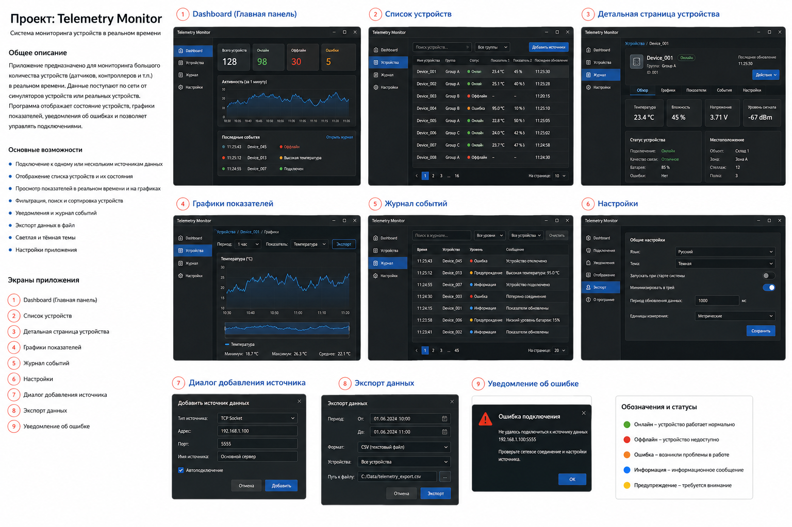

# ТЗ проекта — простым языком

## 1. Что это за приложение

**Telemetry Monitor** — настольная программа, которая подключается к одному или нескольким источникам данных и показывает в реальном времени состояние большого количества условных устройств: датчиков, контроллеров, машин или другого оборудования.

Для учебного проекта реальные устройства не нужны. Их заменяет отдельная программа-симулятор, которая постоянно отправляет телеметрию: температуру, влажность, напряжение, уровень сигнала, состояние подключения и события.

Главная цель приложения для обычного пользователя: открыть его и сразу понять:

- сколько устройств работает;
- какие устройства отключены или имеют ошибку;
- как меняются показатели со временем;
- что произошло недавно;
- можно ли найти конкретное устройство;
- можно ли выгрузить данные в файл;
- что делать, если источник данных недоступен.

## 2. Основные пользовательские сценарии

### Сценарий A — посмотреть общую ситуацию

Пользователь открывает приложение и попадает на Dashboard. Он видит количество устройств, число онлайн/офлайн/ошибок, живой график активности и последние важные события.

### Сценарий B — найти конкретное устройство

Пользователь переходит в список устройств, ищет устройство по имени или ID, фильтрует по группе и открывает подробную карточку.

### Сценарий C — понять, что происходит с устройством

На странице устройства видны текущие показатели, статус связи, место установки и вкладки с графиками/событиями/настройками.

### Сценарий D — посмотреть историю показателя

Пользователь выбирает устройство, период и показатель, например температуру за последний час. Приложение показывает график, минимум, максимум и среднее значение.

### Сценарий E — разобраться в проблеме

Пользователь открывает журнал событий и видит, какое устройство отключилось, где появилась высокая температура и когда связь восстановилась.

### Сценарий F — подключить источник данных

Пользователь открывает диалог добавления источника, задаёт тип подключения, адрес, порт и имя. Если соединение не удаётся, программа показывает понятную ошибку.

### Сценарий G — выгрузить данные

Пользователь выбирает период, устройства, формат и путь, запускает экспорт и может отменить долгую операцию.

## 3. Общая навигация

У приложения есть постоянное левое меню:

- **Dashboard** — общая сводка;
- **Устройства** — список и карточки устройств;
- **Журнал** — события;
- **Настройки** — параметры приложения.

Внутренние страницы открываются без запуска отдельных окон, кроме коротких диалогов: «Добавить источник», «Экспорт», сообщение об ошибке.

---

# 4. Экраны приложения

## Экран 1 — Dashboard / Главная панель

**Задача экрана:** за несколько секунд показать общее состояние системы.

Обязательные элементы:

1. Карточка **«Всего устройств»**.
2. Карточка **«Онлайн»**.
3. Карточка **«Офлайн»**.
4. Карточка **«Ошибки»**.
5. Живой график **активности за последнюю минуту**.
6. Блок **«Последние события»** минимум на несколько записей.
7. Ссылка/кнопка **«Открыть журнал»**.

Поведение:

- числа обновляются автоматически;
- график движется без ручного refresh;
- интерфейс остаётся отзывчивым при высокой частоте данных;
- клик по событию, если у него есть device ID, может открыть устройство;
- состояния обозначаются одинаковыми цветами во всём приложении.

Минимальные данные Dashboard:

- total devices;
- online count;
- offline count;
- error count;
- receive/update rate для графика активности;
- последние пользовательские события.

**Связанные задачи:** 2, 8, 11, 13.

---

## Экран 2 — Список устройств

**Задача экрана:** быстро найти устройство и увидеть его текущее состояние.

Обязательные элементы:

- поле поиска;
- фильтр по группе;
- сортировка хотя бы по имени, статусу и времени последнего обновления;
- кнопка **«Добавить источник»**;
- таблица/список устройств;
- пагинация или другой понятный способ работать с большим количеством строк;
- выбор количества строк на странице, если используется пагинация.

Колонки минимум:

- имя/ID устройства;
- группа;
- статус;
- основной показатель, например температура;
- второй показатель, например влажность;
- время последнего обновления.

Поведение:

- поиск работает по имени и ID;
- фильтр/сортировка не изменяют исходные данные, а только представление;
- новое устройство появляется без перезапуска страницы;
- обновление одной строки не должно пересоздавать весь список;
- клик по строке открывает экран №3.

**Связанная задача:** 3.

---

## Экран 3 — Детальная страница устройства

**Задача экрана:** показать всё важное по одному устройству.

Верхняя часть:

- имя устройства;
- ID;
- группа;
- статус: онлайн / офлайн / ошибка;
- время последнего обновления;
- меню **«Действия»**.

Вкладки:

1. **Обзор**.
2. **Графики**.
3. **Показатели**.
4. **События**.
5. **Настройки**.

### Вкладка «Обзор»

Карточки текущих значений:

- температура;
- влажность;
- напряжение;
- уровень сигнала.

Блок состояния устройства:

- подключение;
- качество связи;
- батарея;
- наличие ошибки.

Блок местоположения:

- объект;
- зона;
- стеллаж;
- полка или другой логический адрес.

Поведение:

- значения обновляются в реальном времени;
- если устройство давно не присылало данные, статус становится offline по понятному правилу;
- вкладка «Графики» ведёт к экрану №4;
- вкладка «События» показывает журнал только этого устройства.

**Связанные задачи:** 3, 9, 11.

---

## Экран 4 — Графики показателей

**Задача экрана:** посмотреть изменение конкретного показателя во времени.

Обязательные элементы:

- выбранное устройство;
- выбор периода, минимум: `15 минут / 1 час / 6 часов`;
- выбор показателя, минимум: температура, влажность, напряжение, signal level;
- основной line chart;
- краткая навигационная/overview-полоса под графиком или эквивалентный контрол диапазона;
- минимум / максимум / среднее;
- кнопка **«Экспорт»**.

Технологический выбор для графика в core-версии: **Qt Graphs 2D** (`GraphsView`, `LineSeries`).

Поведение:

- переключение показателя не блокирует UI;
- история имеет верхнюю границу по памяти;
- статистика строится по выбранному диапазону;
- кнопка Export открывает экран №8.

**Связанные задачи:** 9, 10, 13.

Документация:

- https://doc.qt.io/qt-6/qtgraphs-index.html
- https://doc.qt.io/qt-6/graphs-qml-2d.html
- https://doc.qt.io/qt-6/qml-qtgraphs-graphsview.html

---

## Экран 5 — Журнал событий

**Задача экрана:** объяснить пользователю, что происходило в системе.

Это **не то же самое**, что технические `qDebug`/`QLoggingCategory` логи разработчика. Журнал содержит понятные пользователю события.

Обязательные элементы:

- поиск по журналу;
- фильтр по уровню;
- фильтр по устройству;
- кнопка очистки пользовательского журнала;
- таблица событий;
- пагинация или виртуализированный список.

Поля события:

- время;
- устройство;
- уровень;
- сообщение.

Уровни:

- **Информация** — обычное событие;
- **Предупреждение** — требует внимания;
- **Ошибка** — операция/устройство работает неправильно.

Примеры:

- устройство подключено;
- устройство отключено;
- высокая температура;
- потеряно соединение с источником;
- источник восстановил соединение;
- экспорт завершён / отменён / завершился ошибкой.

**Связанная задача:** 11.

---

## Экран 6 — Настройки

**Задача экрана:** хранить пользовательские предпочтения между запусками приложения.

Левое меню настроек содержит разделы:

- Общие;
- Подключения;
- Уведомления;
- Отображение;
- Экспорт;
- О программе.

### Обязательный core-раздел «Общие»

- язык интерфейса;
- тема: светлая / тёмная / системная;
- «запускать при старте системы» — настройка присутствует; реальная OS-регистрация допускается как post-core extension;
- «минимизировать в трей» — настройка присутствует; системный tray integration допускается как post-core extension;
- период визуального обновления данных в миллисекундах;
- единицы измерения;
- кнопка **«Сохранить»**.

### Подключения

Показывает сохранённые источники и позволяет открыть экран №7 для нового источника.

### Уведомления

Позволяет выбрать, какие пользовательские события считать уведомлениями. Реальные системные desktop notifications — необязательное расширение.

### Отображение

Настройки, влияющие только на presentation: например видимые колонки, период графика по умолчанию.

### Экспорт

Формат и каталог экспорта по умолчанию.

### О программе

Название, версия, версия Qt, короткое описание проекта.

Хранение настроек core-версии: `QSettings`.

**Связанная задача:** 12.

Документация:

- https://doc.qt.io/qt-6/qsettings.html

---

## Экран 7 — Диалог добавления источника

**Задача экрана:** дать пользователю подключить внешний источник телеметрии без редактирования конфигов вручную.

Поля:

- тип источника;
- адрес;
- порт;
- имя источника;
- флаг **«Автоподключение»**;
- Cancel;
- Add.

Типы источников:

- **UDP Socket** — обязателен в core-плане;
- **TCP Socket** — интерфейс предусматривает его сразу; полноценный TCP connect/reconnect/backoff идёт после core-плана.

На референсе выбран TCP Socket — это демонстрационный выбранный пункт, а не требование начать проект именно с TCP.

Валидация:

- имя не пустое;
- порт в допустимом диапазоне;
- адрес имеет понятный формат;
- нельзя молча создать источник с заведомо невалидными данными.

После Add:

- диалог закрывается только после принятия конфигурации;
- источник появляется в разделе Settings → Connections;
- при ошибке подключения открывается экран №9 и создаётся событие в журнале.

**Связанные задачи:** 5, 7; TCP — post-core extension.

---

## Экран 8 — Экспорт данных

**Задача экрана:** сохранить выбранный диапазон данных в файл, не замораживая приложение.

Поля:

- дата/время «От»;
- дата/время «До»;
- формат;
- устройства: одно / выбранные / все;
- путь к файлу;
- Cancel;
- Export.

Core-формат: **CSV**.

Во время экспорта:

- UI остаётся рабочим;
- показывается progress;
- пользователь может отменить операцию;
- cancel реально прекращает дальнейшую работу, а не только закрывает диалог;
- результат работы не читает живую model из background thread, а использует snapshot.

Для выбора файла можно использовать Qt Quick Dialogs `FileDialog`.

**Связанная задача:** 10.

Документация:

- https://doc.qt.io/qt-6/qtconcurrent-index.html
- https://doc.qt.io/qt-6/qfuture.html
- https://doc.qt.io/qt-6/qpromise.html
- https://doc.qt.io/qt-6/qtquickdialogs-index.html

---

## Экран 9 — Уведомление об ошибке подключения

**Задача экрана:** коротко объяснить, что не получилось и что проверить.

Содержит:

- заголовок, например «Ошибка подключения»;
- человекочитаемое сообщение;
- адрес/имя источника;
- краткую рекомендацию: проверить сеть и настройки источника;
- кнопку OK/Закрыть.

Поведение:

- техническая причина дополнительно идёт в diagnostic log;
- пользовательское событие попадает в экран №5;
- повторный Start/Add не требует перезапуска приложения;
- ошибка не должна оставлять `QThread` или socket в подвешенном состоянии.

**Связанная задача:** 7.

---

# 5. Обозначения и статусы

Во всём UI используется единая семантика:

| Статус | Цвет на референсе | Смысл |
|---|---|---|
| Онлайн | зелёный | устройство работает и недавно присылало данные |
| Офлайн | красный | устройство недоступно или давно не присылало данные |
| Ошибка | оранжевый | есть конкретная проблема в работе |
| Информация | синий | обычное пользовательское событие |
| Предупреждение | жёлтый | ситуация требует внимания, но система продолжает работу |

Цвет — только дополнительный индикатор. Текстовый статус обязателен, чтобы смысл не зависел только от цвета.

# 6. Что не является целью первой версии

- реальное промышленное оборудование;
- облачный backend;
- авторизация/роли пользователей;
- сложная база данных;
- мобильное приложение;
- production-grade installer;
- идеальная дизайн-система;
- неограниченная история за месяцы/годы.

# 7. Definition of Done всего продукта

- [ ] Все экраны №1–9 существуют и связаны навигацией/диалогами согласно этому ТЗ.
- [ ] Dashboard отражает живое состояние симулятора.
- [ ] Устройства ищутся, фильтруются, сортируются и открываются в детальную страницу.
- [ ] История показателей отображается графиком и имеет min/max/avg.
- [ ] Есть отдельный пользовательский журнал событий.
- [ ] Основные настройки переживают перезапуск приложения.
- [ ] Источник UDP добавляется через UI; ошибки показываются экраном №9.
- [ ] CSV export имеет progress/cancel и не блокирует GUI.
- [ ] GUI/model никогда не изменяются из background thread.
- [ ] При overload память не растёт без ограничений.
- [ ] При закрытии приложения не остаются работающие threads/sockets.
- [ ] Для каждого важного async failure path есть тест или воспроизводимый сценарий.
